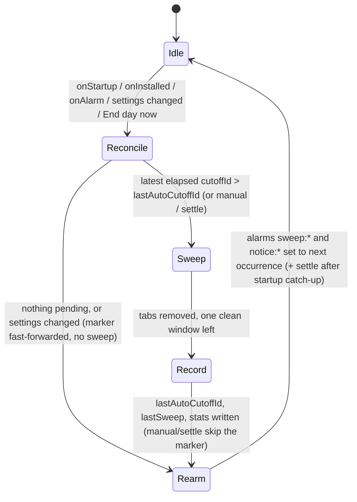

## Context

Greenfield WebExtension. See proposal.md for motivation. Platform constraints that shape the design (verified against current docs, Aug 2026):

- MV3 background is non-persistent on both targets — a service worker on Chrome, an event page on Firefox — terminated when idle (~30 s) and re-created on events. Global state and `setTimeout` do not survive; only `chrome.alarms` + `chrome.storage` do. Event listeners must be registered synchronously at the top level or the background will not be woken for them.
- `chrome.alarms`: minimum granularity 30 s (Chrome 120+), firing may be delayed arbitrarily, does not fire while the browser is closed. Chrome persists alarms across restarts (`persistAcrossSessions`, explicit flag from Chrome 150); Firefox and Safari do not — alarms must be recreated on `runtime.onStartup` / `runtime.onInstalled` for portability.
- There is no extension API to read or change the browser's "On startup / Continue where you left off" setting. Session restore therefore has to be defeated at runtime (catch-up sweep on startup), not prevented.
- `chrome.sessions` on Chrome exposes only `getRecentlyClosed`, `restore`, `getDevices`. Firefox additionally has `sessions.forgetClosedTab/Window`. So on Chrome, "Reopen closed tab" (Cmd+Shift+T) remains a backdoor for the current browser session; on Firefox it can be closed.
- Chrome Web Store removes MV2 extensions on 2026-08-31; MV3 is the only target.
- Firefox requires `browser_specific_settings.gecko.data_collection_permissions` on all new extensions; `addons-linter` warns `MISSING_DATA_COLLECTION_PERMISSIONS` without it and AMO enforces it at signing. Verified against addons-linter, Aug 2026: declaring `{"required": ["none"]}` takes our manifest to zero lint findings. Chrome has no manifest equivalent — the Web Store asks the same question on its privacy-practices form instead.
- Prior art (Tab Wrangler, Tabsence, Auto Close Inactive Tabs, Chrome Memory Saver, Chrome Android's inactive-tabs bucket) is inactivity-based and always pairs closing with an archive/whitelist. None implements a time-of-day cutoff with no recovery; that gap is the product.

## Goals / Non-Goals

**Goals:**
- Sweep is unavoidable: any path by which yesterday's tabs could survive into today (browser closed at cutoff, sleep, session restore, background death) is handled.
- Sweep is idempotent per cutoff and safe under duplicate events.
- Zero per-tab persistence anywhere in the extension.
- Small enough that the whole background logic fits in one file and can be reasoned about in a review.

**Non-Goals:**
- Defeating browser history or the browser's own "recently closed" on Chrome (impossible via API; documented as a known backdoor).
- Cross-device schedule sync.
- Any UI beyond popup + options page.
- Safari support in this change (requires an Xcode wrapper app; revisit later).

## Decisions

### D1. Chrome and Firefox from one WebExtension codebase
Chosen: write portable code against the promise-based extension APIs, keep browser-specific behaviour behind a thin `platform` module (`forgetClosed()` no-op on Chrome, real on Firefox; alarm re-arming unconditional), and generate a per-browser manifest at build time — Chrome declares `background.service_worker`; Firefox declares an event page (`background.scripts`), `browser_specific_settings.gecko.id`, and the extra `sessions` permission. Alternatives: Chrome-only with Firefox as a follow-up (rejected: Firefox's `sessions.forgetClosedTab` is the only way to close the reopen-closed-tab backdoor, and the portability cost is one manifest overlay plus the shim); WXT/Plasmo framework (adds a build system for ~200 lines of code — not worth it; plain TypeScript + esbuild).

### D2. Two-layer scheduling: named alarms + startup reconciliation
Chosen: one alarm per cutoff (`sweep:HH:MM`, `when` = next occurrence, non-repeating, re-armed after firing) plus a `reconcile()` function run on `runtime.onStartup`, `runtime.onInstalled`, every alarm firing, and every settings change. `reconcile()` computes the most recent cutoff instant ≤ now, compares it to `lastSweep.cutoffId`, sweeps if newer, then re-arms all alarms. This makes the alarm merely a wake-up hint; correctness comes from reconciliation. Alternatives: a repeating 1-minute alarm polling the clock (simpler but wakes the worker 1,440×/day for nothing); relying on `persistAcrossSessions` (Chrome-only, and there is a known bug where alarms are lost after extension reload + restart).

Non-repeating alarms recomputed with `when` (not `periodInMinutes: 1440`) is what makes DST/timezone changes work — the next occurrence is always computed from the current local clock.

### D3. Cutoff identity for idempotency
`cutoffId = YYYY-MM-DD + 'T' + HH:MM` in local time. Two storage keys with distinct roles:

- `lastAutoCutoffId` — the idempotency marker. Always a date-based cutoffId, written only by scheduled/catch-up sweeps. A scheduled sweep for a cutoff runs iff its `cutoffId` is lexically greater than `lastAutoCutoffId`. Lexical comparison is safe because every value in this key has the same `YYYY-MM-DDTHH:MM` shape.
- `lastSweep = {reason: 'auto'|'manual', at, closed}` — display stats only. Written by every sweep, never consulted by scheduling logic.

Manual sweeps update `lastSweep` but not `lastAutoCutoffId`, so the next scheduled cutoff still fires (per spec). Catch-up on startup runs at most one sweep even if several cutoffs were missed — sweeping is not cumulative, only the latest missed cutoff matters.

Rejected: a single `lastSweep.cutoffId` holding either a date id or `'manual:' + ISO`. That poisons the lexical comparison (`'m' > '2'`), so one manual sweep would suppress every future scheduled sweep.

Settings edits never sweep retroactively: when `reconcile()` is triggered by a settings change, it first fast-forwards `lastAutoCutoffId` to the latest elapsed cutoff under the **new** schedule, then re-arms. Otherwise moving a cutoff to a time already past today (18:00 → 16:00 at 17:00) would instantly close all tabs, including the options page being edited, with no pre-notice.

### D4. Sweep algorithm
```
windows = chrome.windows.getAll({populate:true, windowTypes:['normal']})
if none: return (nothing to do)
keepWindow = if keepPinned: window with most pinned tabs (tie: focused, then first)
             else: focused window ?? first
if keepPinned: move pinned tabs from other windows into keepWindow
               // tabs.move drops pinned state — re-pin via tabs.update
if keepWindow would end up with zero surviving tabs:
    create one new-tab in it                // guarantees browser doesn't exit
tabsToClose = all tabs in all normal windows
              minus the new tab
              minus (pinned tabs if keepPinned)
chrome.tabs.remove(tabsToClose)             // single batch call; a window whose
                                            // last tab is removed closes itself
record counters
platform.forgetClosed()                     // Firefox only
```
No explicit `windows.remove` is needed: removing a window's last tab closes the window. With `keepPinned` on, non-keep windows are emptied by the pinned-tab moves plus `tabs.remove`, so they close themselves too.
`beforeunload` prompts: `tabs.remove` may leave a tab that shows "Leave site?". We do not retry or force; the sweep is recorded as completed (spec: atomic from the user's perspective, one straggler is acceptable). Alternative considered: `chrome.windows.remove` per window — fails the "leave one clean window" requirement and behaves differently on macOS where the app keeps running with zero windows.

Private/incognito windows: `windows.getAll` returns them only when the user has granted private-browsing access (Chrome "Allow in Incognito", Firefox "Run in Private Windows"), so the default leave-untouched behaviour needs no code. With access granted the same algorithm runs, but per context: pinned-tab consolidation happens separately for regular and private windows (`tabs.move` cannot cross the boundary anyway), the guaranteed clean new-tab window is always a regular window, and a private window survives only if it holds kept pinned tabs. Manifest declares `incognito: "spanning"` (the only mode Firefox supports) so one background instance sees both contexts.

### D5. Notice via alarms too
A second alarm `notice:HH:MM` at `cutoff − N minutes` fires the notification (if enabled) and starts a 1-minute repeating `badge` alarm that updates the badge text until the sweep. Badge is cleared by the sweep. Alternative: `setInterval` in the worker — dies with the worker.

### D6. Storage layout
`chrome.storage.local` only (no `sync`: schedule sync across devices is a non-goal and `sync` has quota/latency quirks). Keys: `settings` `{cutoffs: string[], noticeMinutes, notify, keepPinned}`, `lastAutoCutoffId: string`, `lastSweep` `{reason, at, closed}`, `stats` `{lifetimeClosed}`, `onboarded: true`. Nothing else, ever — this is what makes the "no archive" spec checkable by reading storage.

The manifest's `data_collection_permissions: {required: ["none"]}` (D1's Firefox overlay) is the outward-facing half of this decision: D6 makes "no archive" checkable by reading storage after the fact, the declaration makes it checkable in the install prompt beforehand. The two have to be kept in step — anything added to this key list that is not an aggregate counter invalidates the declaration, not just the spec.

### D7. Onboarding = options page, once
`onInstalled` with `reason === 'install'` opens the options page and sets `onboarded`. Updates never open anything.

### D8. Startup settle pass
Session restore populates windows asynchronously; `runtime.onStartup` can fire before restored tabs exist, so a catch-up sweep at startup may enumerate a partial tab set and miss tabs that materialise moments later — a hole in "the sweep is unavoidable", not a cosmetic flash. When a catch-up sweep runs from `onStartup`, a one-shot `settle` alarm is set for 60 s later; its handler repeats the sweep for the same cutoff (bypassing the idempotency check by design — it neither reads nor advances `lastAutoCutoffId`, and its closed-tab count is folded into the same sweep's stats). Trade-off: tabs the user opens in that first minute are closed too; acceptable, since the contract is starting the day at zero. Alternatives rejected: delaying the first sweep (leaves the restored session usable in the gap — worse); distinguishing restored tabs from user-opened ones (not reliably possible via the tabs API).

### D9. Sweep and control flow



### D10. Visual style: shadcn's token system, hand-written CSS
Chosen: adopt the *design language* of shadcn/ui — its token names, OKLCH palette, radius scale and control proportions — implemented as ~150 lines of hand-written CSS in one shared `ui/theme.css`, with no Tailwind, no Radix, no React. shadcn/ui is not a dependency you install (it is copy-in React components on top of Tailwind + Radix); adopting the actual stack would pull a UI framework and a CSS build step into a project whose entire UI is one button, six inputs and three stat lines — the same trade already rejected in D1.

Tokens are CSS custom properties on `:root`, redefined once under `@media (prefers-color-scheme: dark)`. Values are taken verbatim from shadcn's current default (`neutral`) theme, which is OKLCH-based — verified against the upstream theming docs, Aug 2026. The subset we need:

```css
:root {
  --radius: 0.625rem;
  --background: oklch(1 0 0);          --foreground: oklch(0.145 0 0);
  --card: oklch(1 0 0);                --muted: oklch(0.97 0 0);
  --muted-foreground: oklch(0.556 0 0);
  --primary: oklch(0.205 0 0);         --primary-foreground: oklch(0.985 0 0);
  --destructive: oklch(0.577 0.245 27.325);
  --border: oklch(0.922 0 0);          --input: oklch(0.922 0 0);
  --ring: oklch(0.708 0 0);
}
@media (prefers-color-scheme: dark) {
  :root {
    --background: oklch(0.145 0 0);    --foreground: oklch(0.985 0 0);
    --card: oklch(0.205 0 0);          --muted: oklch(0.269 0 0);
    --muted-foreground: oklch(0.708 0 0);
    --primary: oklch(0.922 0 0);       --primary-foreground: oklch(0.205 0 0);
    --destructive: oklch(0.704 0.191 22.216);
    --border: oklch(1 0 0 / 10%);      --input: oklch(1 0 0 / 15%);
    --ring: oklch(0.556 0 0);
  }
}
```

One deliberate divergence from upstream: shadcn gates its dark values behind a `.dark` class (its own toggle drives it); we gate them on `prefers-color-scheme` instead, since there is no toggle to drive. `oklch()` is supported in the browsers we target (Chrome 111+, Firefox 113+) and MV3 already floors us above that. Note that the current default theme has no `--destructive-foreground`: destructive buttons use white text.

Every rule references tokens only, never literal colors, so the dark theme is a single block of variable overrides and "does it work in dark mode" is checkable by reading one file. `--destructive` is reserved for the "End day now" button: the one control in the product that destroys work should look like it.

Theming follows the OS/browser automatically via `prefers-color-scheme`; `color-scheme: light dark` is declared so the browser paints the popup backdrop, form controls and scrollbars to match, avoiding a white flash before paint in a dark-themed browser. **No theme setting is added** — a light/dark toggle would be the fifth control on an options page whose spec fixes the control list at four, and the OS preference is already the right answer. This keeps the `Settings surface` requirement unchanged.

Alternatives rejected: real shadcn/ui (React + Tailwind + Radix + a Tailwind build — contradicts D1); a CSS framework such as Pico or Water.css (smaller, but generic-looking and still a dependency that themes everything by element selector); unstyled browser defaults (fails the "stylish" bar and looks broken next to the browser's own UI in dark mode).

## Risks / Trade-offs

- [Chrome "Reopen closed tab" restores swept tabs for the rest of the session] → Documented limitation; on Firefox `forgetClosedTab` is called. Recommend the user restart the browser after the sweep if they care; the next-day catch-up sweep is unaffected because history-restored tabs are just tabs.
- [Alarm fires late or not at all while device sleeps] → `reconcile()` on any wake-up event; worst case the sweep happens at next browser start, which still satisfies "start the day with zero tabs".
- [Firefox/Safari drop alarms on restart] → alarms are always re-armed from settings in `reconcile()`; never assumed to exist.
- [`beforeunload` dialog blocks a tab] → accepted; sweep recorded as done. Not adding force-close because that would need `chrome.debugger` or `chrome.tabs.remove` retries that still show the dialog.
- [User disables the extension to dodge a cutoff] → Out of scope; the tool enforces a habit, it is not a parental control. The catch-up sweep on re-enable makes disabling only a temporary escape.
- [Background terminated mid-sweep] → `tabs.remove` is a single call; the browser completes it even if the background dies. Counters may be lost in that edge; acceptable (aggregate stats only).
- [User has "Continue where you left off" on and a slow machine] → session restore may still be materialising tabs when the startup sweep enumerates windows, letting restored tabs survive. Mitigated by the settle pass (D8); tabs restored later than ~60 s after startup would escape, which we accept as a bounded residual risk.
- [Multiple browser profiles] → extension is per-profile; each profile needs its own install. Documented.

## Migration Plan

Greenfield; no migration. Rollback = remove extension. Storage schema carries a `version` field from day one so future changes can migrate `settings`.

## Open Questions

- Should the pre-cutoff badge count minutes or show a static glyph? Cosmetic; can be settled during implementation.
- Whether to publish on the Chrome Web Store at all or keep it as a personal unpacked/self-hosted extension. Does not change specs or tasks.
