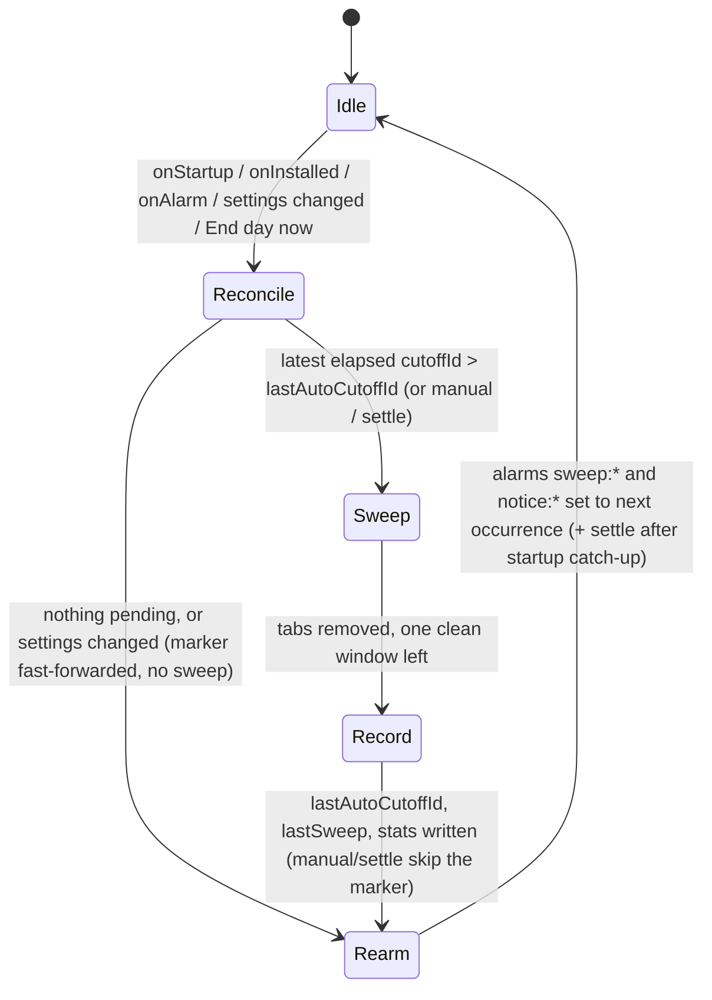

## Context

Greenfield WebExtension. See proposal.md for motivation. Platform constraints that shape the design (verified against current docs, Aug 2026):

- MV3 background is non-persistent on both targets — a service worker on Chrome, an event page on Firefox — terminated when idle (~30 s) and re-created on events. Global state and `setTimeout` do not survive; only `chrome.alarms` + `chrome.storage` do. Event listeners must be registered synchronously at the top level or the background will not be woken for them.
- `chrome.alarms`: minimum granularity 30 s (Chrome 120+), firing may be delayed arbitrarily, does not fire while the browser is closed. Chrome persists alarms across restarts (`persistAcrossSessions`, explicit flag from Chrome 150); Firefox and Safari do not — alarms must be recreated on `runtime.onStartup` / `runtime.onInstalled` for portability.
- There is no extension API to read or change the browser's "On startup / Continue where you left off" setting. Session restore therefore has to be defeated at runtime (catch-up sweep on startup), not prevented.
- `chrome.sessions` on Chrome exposes only `getRecentlyClosed`, `restore`, `getDevices`. Firefox additionally has `sessions.forgetClosedTab/Window`. So on Chrome, "Reopen closed tab" (Cmd+Shift+T) remains a backdoor for the current browser session; on Firefox it can be closed.
- Chrome Web Store removes MV2 extensions on 2026-08-31; MV3 is the only target.
- Firefox requires `browser_specific_settings.gecko.data_collection_permissions` on all new extensions; `addons-linter` warns `MISSING_DATA_COLLECTION_PERMISSIONS` without it and AMO enforces it at signing. Verified against addons-linter, Aug 2026: declaring `{"required": ["none"]}` takes our manifest to zero lint findings. Chrome has no manifest equivalent — the Web Store asks the same question on its privacy-practices form instead.
- Prior art (Tab Wrangler, Tabsence, Auto Close Inactive Tabs, Chrome Memory Saver, Chrome Android's inactive-tabs bucket) is inactivity-based and always pairs closing with an archive/whitelist. None implements a time-of-day cutoff with no recovery; that gap is the product.

## Goals / Non-Goals

**Goals:**
- Sweep is unavoidable: any path by which yesterday's tabs could survive into today (browser closed at cutoff, sleep, session restore, background death) is handled.
- Sweep is idempotent per cutoff and safe under duplicate events.
- Zero per-tab persistence anywhere in the extension.
- Small enough that the whole background logic fits in one file and can be reasoned about in a review.

**Non-Goals:**
- Defeating browser history or the browser's own "recently closed" on Chrome (impossible via API; documented as a known backdoor).
- Cross-device schedule sync.
- Any UI beyond popup + options page.
- Safari support in this change (requires an Xcode wrapper app; revisit later).

## Decisions

### D1. Chrome and Firefox from one WebExtension codebase
Chosen: write portable code against the promise-based extension APIs, keep browser-specific behaviour behind a thin `platform` module (`forgetClosed()` no-op on Chrome, real on Firefox; alarm re-arming unconditional), and generate a per-browser manifest at build time — Chrome declares `background.service_worker`; Firefox declares an event page (`background.scripts`), `browser_specific_settings.gecko.id`, and the extra `sessions` permission. Alternatives: Chrome-only with Firefox as a follow-up (rejected: Firefox's `sessions.forgetClosedTab` is the only way to close the reopen-closed-tab backdoor, and the portability cost is one manifest overlay plus the shim); WXT/Plasmo framework (adds a build system for ~200 lines of code — not worth it; plain TypeScript plus one bundler, per D11).

### D2. Two-layer scheduling: named alarms + startup reconciliation
Chosen: one alarm per cutoff (`sweep:HH:MM`, `when` = next occurrence, non-repeating, re-armed after firing) plus a `reconcile()` function run on `runtime.onStartup`, `runtime.onInstalled`, every alarm firing, and every settings change. `reconcile()` computes the most recent cutoff instant ≤ now, compares it to `lastSweep.cutoffId`, sweeps if newer, then re-arms all alarms. This makes the alarm merely a wake-up hint; correctness comes from reconciliation. Alternatives: a repeating 1-minute alarm polling the clock (simpler but wakes the worker 1,440×/day for nothing); relying on `persistAcrossSessions` (Chrome-only, and there is a known bug where alarms are lost after extension reload + restart).

Non-repeating alarms recomputed with `when` (not `periodInMinutes: 1440`) is what makes DST/timezone changes work — the next occurrence is always computed from the current local clock.

### D3. Cutoff identity for idempotency
`cutoffId = YYYY-MM-DD + 'T' + HH:MM` in local time. Two storage keys with distinct roles:

- `lastAutoCutoffId` — the idempotency marker. Always a date-based cutoffId, written only by scheduled/catch-up sweeps. A scheduled sweep for a cutoff runs iff its `cutoffId` is lexically greater than `lastAutoCutoffId`. Lexical comparison is safe because every value in this key has the same `YYYY-MM-DDTHH:MM` shape.
- `lastSweep = {reason: 'auto'|'manual', at, closed}` — display stats only. Written by every sweep, never consulted by scheduling logic.

Manual sweeps update `lastSweep` but not `lastAutoCutoffId`, so the next scheduled cutoff still fires (per spec). Catch-up on startup runs at most one sweep even if several cutoffs were missed — sweeping is not cumulative, only the latest missed cutoff matters.

Rejected: a single `lastSweep.cutoffId` holding either a date id or `'manual:' + ISO`. That poisons the lexical comparison (`'m' > '2'`), so one manual sweep would suppress every future scheduled sweep.

Settings edits never sweep retroactively: when `reconcile()` is triggered by a settings change, it first fast-forwards `lastAutoCutoffId` to the latest elapsed cutoff under the **new** schedule, then re-arms. Otherwise moving a cutoff to a time already past today (18:00 → 16:00 at 17:00) would instantly close all tabs, including the options page being edited, with no pre-notice.

A fresh install takes the same fast-forward branch, for the same reason. The marker is unset (`''`) on a new profile, and `latestElapsedCutoff()` always names *some* elapsed cutoff — yesterday's when none of today's has passed — so an unseeded first `reconcile()` would sweep the moment the extension is installed, closing every tab the user had open (and racing the onboarding page D7 has just opened) with no pre-notice. So: an unset marker means "nothing to catch up on", is seeded with the latest elapsed cutoff, and the first sweep happens at the next cutoff (sweep-schedule.spec "Fresh install"). Since the consent gate (D7) holds every reconcile back until the user accepts the contract, the seed actually lands on the acceptance-triggered reconcile, anchoring the schedule at the moment of consent rather than at install. Seeding also makes `''` unreachable after the first run, so the lexical-comparison invariant is untouched.

### D4. Sweep algorithm
```
if settings.autoBookmark: bookmarkAtRiskTabs()   // D12; failure logged, sweep proceeds
windows = chrome.windows.getAll({populate:true, windowTypes:['normal']})
if none: return (nothing to do)
keepWindow = if keepPinned: window with most pinned tabs (tie: focused, then first)
             else: focused window ?? first
if keepPinned: move pinned tabs from other windows into keepWindow
               // tabs.move drops pinned state — re-pin via tabs.update
if keepWindow would end up with zero surviving tabs:
    create one new-tab in it                // guarantees browser doesn't exit
tabsToClose = all tabs in all normal windows
              minus the new tab
              minus (pinned tabs if keepPinned)
chrome.tabs.remove(tabsToClose)             // single batch call; a window whose
                                            // last tab is removed closes itself
record counters
platform.forgetClosed()                     // Firefox only
```
`forgetClosed()` is passed the instant captured just before `tabs.remove`, and skips recently-closed entries older than it: tab-sweep.spec asks that *swept* tabs leave that list, not that the list be emptied, and tabs or windows the user closed by hand earlier in the day are not ours to destroy. Entries carrying no usable timestamp are treated as ours — leaving a swept tab restorable would break the contract, forgetting one extra entry would not.

No explicit `windows.remove` is needed: removing a window's last tab closes the window. With `keepPinned` on, non-keep windows are emptied by the pinned-tab moves plus `tabs.remove`, so they close themselves too.
`beforeunload` prompts: `tabs.remove` may leave a tab that shows "Leave site?". We do not retry or force; the sweep is recorded as completed (spec: atomic from the user's perspective, one straggler is acceptable). Alternative considered: `chrome.windows.remove` per window — fails the "leave one clean window" requirement and behaves differently on macOS where the app keeps running with zero windows.

Private/incognito windows: `windows.getAll` returns them only when the user has granted private-browsing access (Chrome "Allow in Incognito", Firefox "Run in Private Windows"), so the default leave-untouched behaviour needs no code. With access granted the same algorithm runs, but per context: pinned-tab consolidation happens separately for regular and private windows (`tabs.move` cannot cross the boundary anyway), the guaranteed clean new-tab window is always a regular window, and a private window survives only if it holds kept pinned tabs. Manifest declares `incognito: "spanning"` (the only mode Firefox supports) so one background instance sees both contexts.

### D5. Notice via alarms too
A second alarm `notice:HH:MM` at `cutoff − N minutes` fires the notification (if enabled) and starts a 1-minute repeating `badge` alarm that updates the badge text until the sweep. Badge is cleared by the sweep. Alternative: `setInterval` in the worker — dies with the worker.

### D6. Storage layout
`chrome.storage.local` only (no `sync`: schedule sync across devices is a non-goal and `sync` has quota/latency quirks). Keys: `settings` `{cutoffs: string[], noticeMinutes, notify, autoBookmark, keepPinned}`, `lastAutoCutoffId: string`, `lastSweep` `{reason, at, closed, bookmarked}`, `stats` `{lifetimeClosed}`, `accepted: true`. Nothing else, ever — this is what makes the "no archive" spec checkable by reading storage. `lastSweep.bookmarked` is an aggregate boolean ("were the closed tabs written to bookmarks first"), never a list; the bookmark writes themselves go to the browser's own bookmarks (D12), not to extension storage.

The manifest's `data_collection_permissions: {required: ["none"]}` (D1's Firefox overlay) is the outward-facing half of this decision: D6 makes "no archive" checkable by reading storage after the fact, the declaration makes it checkable in the install prompt beforehand. The two have to be kept in step — anything added to this key list that is not an aggregate counter invalidates the declaration, not just the spec.

### D7. Onboarding = one dedicated screen, once, and nothing destructive before acceptance
`onInstalled` with `reason === 'install'` opens `ui/onboarding.html` — a single screen that states the contract as numbered terms (every tab in every normal window is included, no undo/snooze/per-tab exception; closing the browser doesn't dodge it; no data is collected) with the real first cutoff in the headline. Until the user explicitly accepts, the extension is inert: viewing the page writes nothing, and `reconcile()` refuses to seed the marker, arm any schedule alarm or run an automatic sweep while the `accepted` flag is unset. Three actions: "I understand. Start at 18:00." writes `accepted` and closes the page; "Pick a different time" navigates the same tab to the options page *without* accepting — the options page shows the equivalent accept button until the flag is set; a plain-text decline underneath calls `management.uninstallSelf({showConfirmDialog: true})`, handing the user to the browser's own uninstall confirmation (self-uninstall needs no permission; self-*disable* would require `management`, which we don't request). Writing `accepted` fires `storage.onChanged`, whose reconcile takes the fast-forward branch — so acceptance anchors the schedule at that moment and never sweeps retroactively, however long consent was pending. An explicit "End day now" stays available before acceptance: the click is its own consent for that one sweep. The page is never opened again automatically; updates never open anything. The options page keeps the standing one-sentence contract in its header but no longer plays the onboarding role (this supersedes the earlier options-page-with-highlight approach and the earlier no-decline-button rule).

### D8. Startup settle pass
Session restore populates windows asynchronously; `runtime.onStartup` can fire before restored tabs exist, so a catch-up sweep at startup may enumerate a partial tab set and miss tabs that materialise moments later — a hole in "the sweep is unavoidable", not a cosmetic flash. When a catch-up sweep runs from `onStartup`, a one-shot `settle` alarm is set for 60 s later; its handler repeats the sweep for the same cutoff (bypassing the idempotency check by design — it neither reads nor advances `lastAutoCutoffId`, and its closed-tab count is folded into the same sweep's stats). Trade-off: tabs the user opens in that first minute are closed too; acceptable, since the contract is starting the day at zero. Alternatives rejected: delaying the first sweep (leaves the restored session usable in the gap — worse); distinguishing restored tabs from user-opened ones (not reliably possible via the tabs API).

**Browser start is not the same event as background cold start.** MV3 re-evaluates the background script on every wake, including the wake caused by the `sweep:HH:MM` alarm, so the top-level bootstrap `reconcile()` runs at every cutoff — and, being queued synchronously at module evaluation, it always reaches the serialisation queue before the `onAlarm` dispatch that woke it. It therefore carries its own trigger (`'wake'`), which never arms `settle`; only `runtime.onStartup` does. Otherwise every ordinary daily cutoff would be followed by a second sweep 60 s later, which is precisely the trade-off this decision accepts *once at startup* and rejects the rest of the time. The consequence is that at a real browser start the bootstrap is normally the call that performs the catch-up sweep while `onStartup` is the only evidence that the browser just started, so `reconcile()` reports whether it swept and the `onStartup` listener arms the settle pass on the bootstrap's behalf.

The settle pass folds its count into the sweep that armed it, and only into that one: if an "End day now" lands in the 60 s gap, `lastSweep` holds a `manual` record that the settle pass must not rewrite, so it records itself as its own `auto` sweep instead (`reason === 'auto'` plus a recency window is the check).

### D9. Sweep and control flow



### D10. Visual style: the "ab" design-system tokens, hand-written CSS
Chosen: adopt the token system of the Zero Tabbox Redesign canvas (the "ab" design system — the design is the source of truth): warm stone neutrals plus a single ember-orange accent, Geist for UI text and JetBrains Mono for numerals/labels, a 4/6/8/12px radius scale, warm-tinted shadows, and an ember focus ring. Implemented as hand-written CSS in one shared `ui/theme.css`, with no Tailwind, no Radix, no React — the same trade already rejected in D1. This supersedes the earlier shadcn/OKLCH token set.

Structure of the stylesheet, and the two properties the spec checks by reading it (tasks.md 7.2a):

- Tokens are CSS custom properties on `:root` (color ramps `--color-stone-*` / `--color-ember-*`, then semantic aliases `--color-bg/-subtle/-muted`, `--color-surface`, `--color-border/-strong`, `--color-fg/-2/-3`, `--color-accent/-hover/-active/-fg/-soft`, `--color-success/-danger`), redefined once under `@media (prefers-color-scheme: dark)`. Every other rule references tokens only, never literal colors, so "does it work in dark mode" is checkable by reading one file.
- The canvas's light/dark switch is a canvas control, not a product control: theming follows the OS/browser automatically via `prefers-color-scheme`, and `color-scheme: light dark` is declared so the browser paints the popup backdrop, form controls and scrollbars to match, avoiding a white flash before paint in a dark-themed browser. **No theme setting is added** — the OS preference is already the right answer, and the settings surface stays fixed.

Fonts ship with the extension (`ui/fonts/*.woff2`: Geist variable, JetBrains Mono 400/500/600; both OFL-licensed): extension pages may not fetch remote assets, and the no-network guarantee (tab-sweep.spec) would forbid a font CDN anyway. Numerals everywhere (cutoff times, countdowns, counters) use JetBrains Mono with `tnum`+`zero` feature settings so columns align and zeros are slashed.

The accent (ember) role is reserved for the commitment controls, and there are exactly three: "End day now", the onboarding "I understand" button, and the same accept button on the options page's pre-acceptance banner (D7's landing spot for "Pick a different time"). The actions that accept the consequence should be the visually loudest, and nothing else may borrow that weight — switches and the notice-window stops signal "on" and "selected" with the soft accent tint, never the solid fill. Color is emphasis, never the message: all three labels state the action in words. This replaces the earlier red `--destructive` role; the product's one "destructive" act is its whole point, and the brand accent owning it is the redesign's statement.

The popup stops being a clock (redesign canvas, screen 1a): it shows what is at stake ("47 tabs close at"), the next cutoff as the headline numeral with a live ETA (a per-second `MM:SS left` countdown once inside the notice window, tinted accent), the bookmark escape hatch (D12), "End day now", and a gear. Settings is secondary navigation, so it is a bare gear (`.icon-link`: inline SVG at `--color-fg-3`, `--color-fg` on hover, with negative margins cancelling the padding so the hit target grows without moving the glyph). Icon-only controls carry `aria-label` plus `title` and mark their artwork `aria-hidden`, and the universal ember `:focus-visible` ring covers every control (sweep-controls.spec "Accessible interaction states"). For 60 s after a sweep the popup opens on the "Day ended" state — closed count, whether the tabs were bookmarked first, next cutoff — the same window the post-sweep badge lives in, so the two are one moment of feedback.

The options page follows the canvas: cutoff times as chips (numeral + remove ×, dashed "Add cutoff"), the notice window as six fixed stops (0/5/10/20/30/60) with a summary label, three switches (notification, bookmark-everything-first, keep-pinned), and two "Since install" stat cards (lifetime closed, last sweep closed). Switches are checkboxes wearing switch CSS — native semantics and keyboard behaviour for free, `role="switch"` for assistive tech.

Alternatives rejected: shipping the canvas verbatim (it is a React demo with canvas-only controls); real shadcn/ui or Tailwind (contradicts D1); system fonts only (loses the design's character for ~350 KB of OFL-licensed woff2).

### D11. Bun as runtime, bundler and test runner
Chosen: one tool for all three — `bun install` (lockfile `bun.lock`), `Bun.build` for the IIFE bundles, and `bun test` for the unit suite. This removes esbuild and vitest as separate dependencies and leaves `tsc --noEmit` as the only non-Bun step in `verify`. Three consequences are deliberate and worth stating, because each is a capability esbuild or vitest provided for free:

- **No per-browser syntax lowering.** esbuild's `target: ['chrome120']` would fail a build using syntax below the floor; `Bun.build` has no equivalent, so `MIN_CHROME` / `MIN_FIREFOX` now feed only the manifests. The floor is held by `tsconfig`'s `target: ES2022` instead — both floors support ES2022 natively, so the bundle ships the syntax the sources are written in.
- **No incremental watch.** `Bun.build` has no `context`/`rebuild`, so `--watch` is a debounced `fs.watch` loop running the full build. It rebuilds *in place* (`clean: false`) because unlinking `dist/<browser>` unloads an extension loaded unpacked from it.
- **Per-file test processes.** `bun test` loads every file into one runtime and `mock.module` patches the shared registry with live bindings, so one file's mock of `../src/badge` would replace the implementation another file is exercising. `scripts/run-tests.mjs` spawns one `bun test` per file to restore the per-file module graph vitest gave for free; the cost is serial execution of a suite that runs in well under a second.

Alternatives: keep Node + esbuild + vitest (rejected: three toolchain dependencies for a ~1,000-line extension, and the lowering guard is the only thing genuinely lost); Bun for install/test but esbuild for the bundle (rejected: keeps the dependency that the swap exists to remove, for a guard `tsconfig` already provides).

### D12. Bookmarks are the only escape hatch — and it is clickable
The product's answer to "what if a tab matters" has always been "bookmark it"; the redesign makes that answer a button instead of advice. Two entry points, one module (`bookmarks.ts`, the only code that writes bookmarks):

- **Popup "Bookmark all N tabs"**: writes the at-risk tabs (the exact set the next sweep would close — pinned tabs excluded when `keepPinned` is on, so the label and the action count the same tabs) to the browser's bookmarks, then shows a "Saved to bookmarks / zero-tabbox / YYYY-MM-DD" confirmation. Runs only on click.
- **Settings "Bookmark everything first"** (`settings.autoBookmark`, default off): every sweep — scheduled, catch-up, manual, settle — first writes the at-risk set to the same dated folder, then sweeps. A bookmarking failure is logged and the sweep proceeds: the sweep stays unavoidable, the escape hatch is best-effort.

Destination: `zero-tabbox / YYYY-MM-DD` (local calendar day) under the browser's default bookmark parent ("Other bookmarks" on both targets — deliberately not a hard-coded root id, because the ids differ: `'2'` vs `'unfiled_____'`). An existing day folder is appended to. One failed bookmark does not abort the rest — saving 46 of 47 tabs beats saving none.

Why this does not break the no-archive contract: the bookmarks are the *browser's* data, created at the user's explicit request (a click, or an opt-in setting), fully visible and deletable in the browser's own bookmark manager. The extension keeps no reference to them — the only trace in extension storage is the aggregate `lastSweep.bookmarked` boolean (D6) that picks the popup's "Day ended" wording — and no UI ever reads bookmarks back or reopens swept tabs. tab-sweep.spec is narrowed accordingly: the *sweep* still persists nothing per-tab and there is still no restore surface; the prohibition on writing bookmarks is scoped to "except through this escape hatch". The `bookmarks` permission is added to both manifests; the Firefox `data_collection_permissions: {required: ["none"]}` declaration stays accurate — local bookmark writes at user request are not data collection, and nothing is transmitted.

Rejected: a "reopen last sweep" surface built on the dated folders (that is an archive with extra steps — the folder is the browser's, the extension never reads it); bookmarking silently on every sweep (the user must opt in, or the contract's teeth are gone); storing the folder id for later cleanup (a reference is a hook for exactly the feature this product refuses to grow).

### D13. The settings stats are counters, not a log — the last-sweep timestamp is dropped
The settings surface was first specified with three read-only stats: last sweep time, tabs closed last sweep, lifetime total. What ships is two — lifetime closed and last-sweep closed — and this decision records that as a choice rather than leaving it as silent drift. The stats are deliberately aggregate-only, the same line D6 draws in storage: a count answers "did it run", the schedule answers "when next", and a timestamp answers neither — it is closer to a log entry than to a counter, and a log of sweeps is the first step toward the history surface this product refuses to grow (see D12's rejected "reopen last sweep"). `lastSweep.at` stays in storage because the settle pass's recency check (D8) and the popup's 60 s "Day ended" window both need it; it simply is not rendered on the options page. This supersedes the earlier "last sweep time" wording in sweep-controls.spec "Settings surface", which now reads as aggregate stats only. Putting the timestamp back on the surface would be a new product decision, not a restoration.

## Risks / Trade-offs

- [Chrome "Reopen closed tab" restores swept tabs for the rest of the session] → Documented limitation; on Firefox `forgetClosedTab` is called. Recommend the user restart the browser after the sweep if they care; the next-day catch-up sweep is unaffected because history-restored tabs are just tabs.
- [Alarm fires late or not at all while device sleeps] → `reconcile()` on any wake-up event; worst case the sweep happens at next browser start, which still satisfies "start the day with zero tabs".
- [Firefox/Safari drop alarms on restart] → alarms are always re-armed from settings in `reconcile()`; never assumed to exist.
- [`beforeunload` dialog blocks a tab] → accepted; sweep recorded as done. Not adding force-close because that would need `chrome.debugger` or `chrome.tabs.remove` retries that still show the dialog.
- [User disables the extension to dodge a cutoff] → Out of scope; the tool enforces a habit, it is not a parental control. The catch-up sweep on re-enable makes disabling only a temporary escape.
- [Background terminated mid-sweep] → `tabs.remove` is a single call; the browser completes it even if the background dies. Counters may be lost in that edge; acceptable (aggregate stats only).
- [User has "Continue where you left off" on and a slow machine] → session restore may still be materialising tabs when the startup sweep enumerates windows, letting restored tabs survive. Mitigated by the settle pass (D8); tabs restored later than ~60 s after startup would escape, which we accept as a bounded residual risk.
- [Multiple browser profiles] → extension is per-profile; each profile needs its own install. Documented.

## Migration Plan

Greenfield; no migration. Rollback = remove extension. Storage schema carries a `version` field from day one so future changes can migrate `settings`.

## Open Questions

- Should the pre-cutoff badge count minutes or show a static glyph? Cosmetic; can be settled during implementation.
- Whether to publish on the Chrome Web Store at all or keep it as a personal unpacked/self-hosted extension. Does not change specs or tasks.
